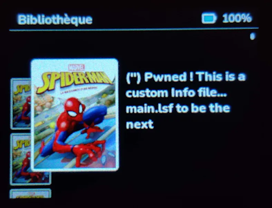

- [TL;DR](#tldr)
  - [Open questions](#open-questions)
  - [Facts](#facts)
  - [Assumptions](#assumptions)
  - [Attack path](#attack-path)
- [Keys (x3)](#keys-x3)
  - [Device Key](#device-key)
  - [Story Key](#story-key)
  - [Firmware Signature ?](#firmware-signature-)

# TL;DR

**Flam still stand...**  

## Open questions
1. modifications on mdf ?

## Facts
* Wifi added networks is not creating a new file on SDCard (might be directly stored in dedicated WIFI ESP32 chip)
* Key file can be the same for all stories
* No Key do not prevent story selection. Info are incorrectly deciphered

## Assumptions 
1. StoryManager starts by deciphering all files to internal Flash before start Lua interpreter

## Validated 
1.  `.mdf` file reuse same strucute as `.md` from Lunii v3  
    (means ciphered part of mdf is made of twice the SNU)
2.  `key` file contains Story AES Key & IV, but ciphered with device key
3.  Audio files are not encrypted
4.  Images files are not encrypted 
5.  It is possible to update `package.cpath`
6.  StoryManager is not in Lua. Updating `package.cpath` from one story and reading from another does not allow to keep first value

## Attack path
1. `info` file : Using info displayed upon story selection
2. Create a .so lib and load it from LUA script
3. Common Lunii and Flam story might share the key. Use Lunii to get key. Key to get plain LSF on Flam.

### 1. Info file
* Using `.mdf` as ciphered known plain text as key file, to generate a ciphered info file and determine where is located story title.  
*This offers a tool to decipher story ciphered data*.  
Using v3 trick allows to know fake story keys ciphered with device keys (even if they are unknown). Doing so, we can forge our own `Info` file  

* Decipher first 0x10 of `main.lsf`

# Keys (x3)

* ✅ Device Key + IV (AES 128)   
* ✅ Story  Key + IV (AES 128)   
* ❓ Update Signature

## Device Key

Applies to following contents:
* second part of `.mdf`
* `key` file
  
Applies to a specific device

## Story Key
 
Applies to following contents:
* `info` file
  
Applies to all stories

## Firmware Signature ?

**NOTE** :   
Thanks to *public* key, we can only `verify()` the signature. Computing it, `sign()` requires the *private* key